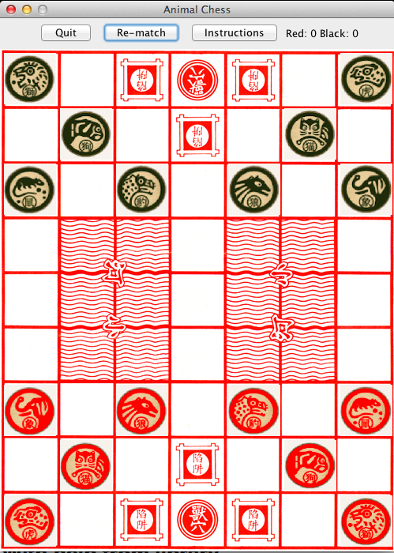
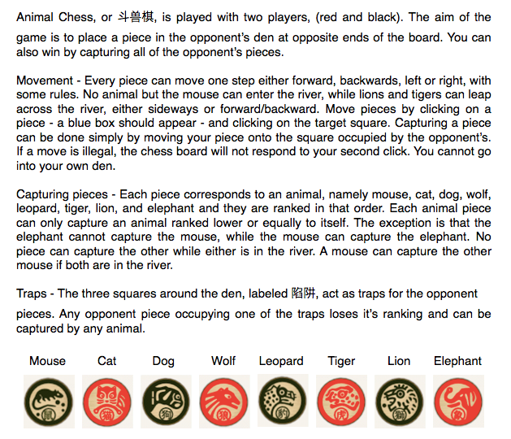

Animal Chess
=============

This program implements the game Animal Chess.

Usage Instructions
====================

To run the game on your computer, download files.zip within the submission folder and run the
following command from terminal: <code>javac \*.java && java Game</code>

Detailed instructions are available from within the game. 

Further descriptions/ instructions of this game can be found [here] (http://ancientchess.com/page/play-doushouqi.htm).

Game Implementation
====================

The game is implemented with the Model-Controller-View (MVC) concept. 

The model package holds Java classes Animal.java, ChessPiece.java and ChessBoard.java. Animal.java 
holds the specific enumeration type for the eight animals and allows for identification and ranking of 
each piece. ChessPiece.java holds the specific data fields for each chess piece, such as whether or not 
it's alive, it's current position, and also the piece image to display for this piece. ChessBoard.java
holds a 2D array representing the current positions of all the chess pieces in play at a given point
of time. It holds the game logic and has a range of methods to manipulate the pieces across the board 
and is primarily used to check if a particular move is legal. 

The view package holds InvisibleButton.java, a class which extends a JButton listen for mouse clicks
on each square of the chess board and pass that information to the controller. It also displays the
relevant button images and draws a border when a piece is selected. BoardPanel.java holds a 2D array
of InvisibleButtons and displays the chess board at any given time. It has access to ChessBoard.java
and will display the pieces according to it's present layout when prompted by the controller. GUI.java
organizes each componenet of the GUI, including the Board Panel, an options toolbar, and also the pop
up JFrames for instructions and to display a message when one player wins. 

The controller package has one class - Controller.java. This class has access to the BoardPanel and
the Chess Board, and listens for user mouse clicks to pass on to the chess board model to process.
It then informs board panel to repaint the board. Controller.java also listens for clicks to reset a
match and update scores. 

Image Credit
====================
The chess board and chess pieces images were borrowed from a free iPhone app called Animal Chess
online by MegaLab.
